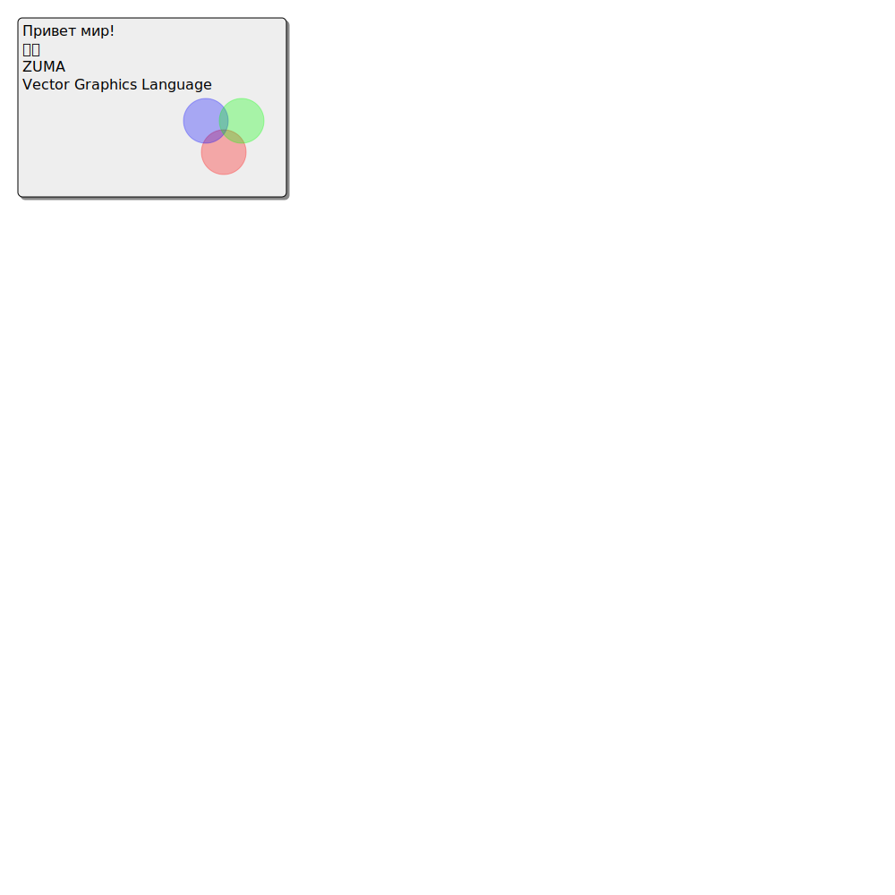

ZUMA - Vector Graphics Language
===============================

## WARNING: Language spec is currently unstable and WILL break.

[This code](examples/front_page01.zm):

```
let starting_point = 20;

let lighter_gray = #eeeeee;
let darker_gray = #888888;

let width = 300;
let height = 200;

let shadow_size = 3;
let start_plus_shadow = [(starting_point + shadow_size), (starting_point + shadow_size)];
let rect_size = [height, width];

rectangle start=start_plus_shadow size=rect_size color=darker_gray stroke-color=darker_gray round-corners=5;

rectangle start=[starting_point, starting_point] size=rect_size color=lighter_gray round-corners=5;

text text = "Привет мир!" start=[(starting_point+20), (starting_point+5)];
text text = "我是" start=[(starting_point+40), (starting_point+5)];
text text = "ZUMA" start=[(starting_point+60), (starting_point+5)];
text text = "Vector Graphics Language" start=[(starting_point+80), (starting_point+5)];

let circle_size = [25, 25];
let opa = 0.3;
ellipse center=[(starting_point+150), (starting_point+230)]
    radius=circle_size color=red stroke-color=red opacity=opa;
ellipse center=[(starting_point+115), (starting_point+210)]
    radius=circle_size color=blue stroke-color=blue opacity=opa;
ellipse center=[(starting_point+115), (starting_point+250)]
    radius=circle_size color=green stroke-color=green opacity=opa;
```

produces this:

